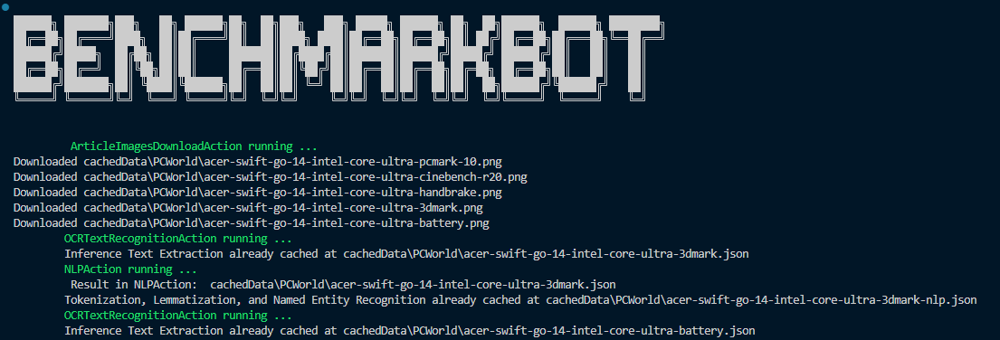

# BenchmarkBot



## Description

BenchmarkBot is a Python application that extracts benchmark data for commercial CPUs and GPUs from a variety of sources, including articles, images, and video.

It uses Intel OpenVINO, PyTorch, EasyOCR for extracting information from visual data, and spaCy, the natural language processing library to perform tokenization, lemmatization and named entity recognition on the results.

The results are aggregated and written to an Excel file, named interview-questions.xlsx.

## Features

- **Pipeline and Actions**: All compute tasks performed by BenchmarkBot are implemented as Actions and executed through pipelines. Some actions result in a single file written to the cachedDir and other actions write multiple files.
- **File Based Caching**: Each Action writes its result to the cachedData directory in the root directory of the project. This allows people that run the program to easily see the result of each action and for BenchmarkBot to not unnecessarily redo CPU/GPU intensive work.
- **Text Extraction**: Text extraction is implemented using both OpenVINO and EasyOCR. OpenVINO uses the horizontal-text-detection and text-recognition-resnet-fc models.
- **Natural Language Processing**: The spaCy natural language processing library is used to build an NLP pipeline of custom pipes that implement tokenization, lemmatization and named entity recognition (NER). BenchmarkBot uses labelled data to train a NER model to associate tokens identified as BENCHMARK, CPU, GPU, SCORE and METRIC. SpaCy rule-based matching is also implemented to increased the accuracy of the model.
- **Training NLP models**: Labeled text was created with https://tecoholic.github.io/ner-annotator/
- **Support for Multiple Platforms**: Tested on Windows, Linux, and macOS.

## Architecture


## Getting Started

### Prerequisites

- Python 3.8 or higher
- Docker (for containerized benchmarks)

### Installation

1. Clone the repository. **_ Please note, I've included the OpenVINO model files in the repository, so users don't need to go download them. However, they are large files that take a while to download. Please have patience. _**

```bash
git clone https://github.com/agnathan/BenchmarkBot.git
```

2. Navigate to the project directory

```bash
cd BenchmarkBot
```

3. Install the required dependencies

```bash
python -m venv benchmarkbot
benchmarkbot/Scripts/activate   # Windows
source benchmarkbot/bub/activate   # Linux or MacOS
pip install -r requirements.txt
```

4. Remove or rename the cached files directory, if you want to download and process from scratch

```
mv cachedData cachedDataOrig
```

5. Install OpenVINO models. This is optional because the OpenVINO models are over 5GB and zipped they are over 2.2GB. If you don't download them, BenchmarkBot defaults to EasyOCR.

[https://drive.google.com/file/d/1A-x9Gfe4Ljw3fJYmAYmoMLrGkFfceteI/view?usp=sharing](Download the OpenVINO Models)

Unzip the openvino-models.zip in the top level directory of BenchmarkBot

5. Run BenchmarkBot

```
python ./main.py   # Run from the top level directory
```

6. Open interview-questions.xlsx to view the results

## Training spaCy Pipelines

Training the Spacy Named Entity Recogizer requires the following steps

1. Annotate the data using https://tecoholic.github.io/ner-annotator/
2. Merge the new annotated data with annotations.json
3. Go to the training directory and run

```
   python .\train-create-ner-training-and-validation-data.py
   python -m spacy train .\config.cfg --output ./models --paths.train .\train_data.spacy --paths.dev .\test_data.spacy
```

4. Test the results
   python .\text-ner-inference.py
5. Note scikit-learn is used to divide the labeled data into training data and validation data
